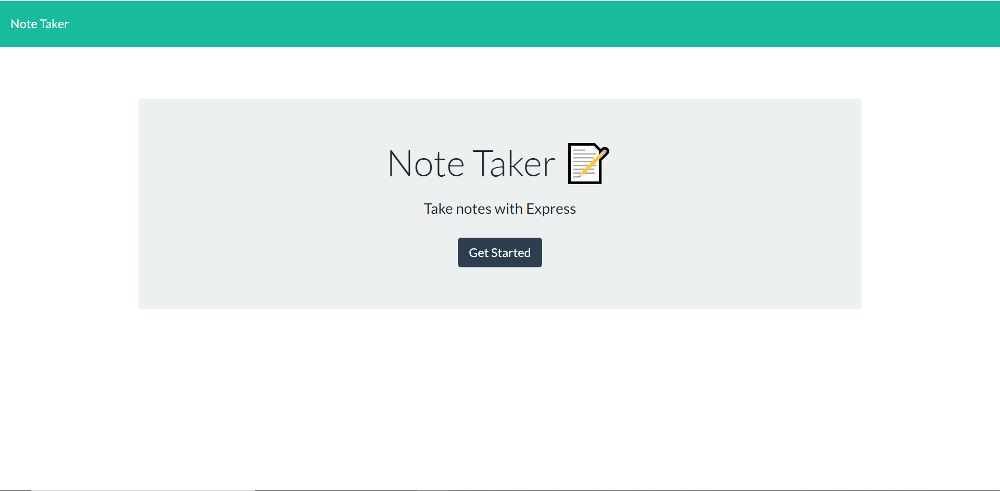
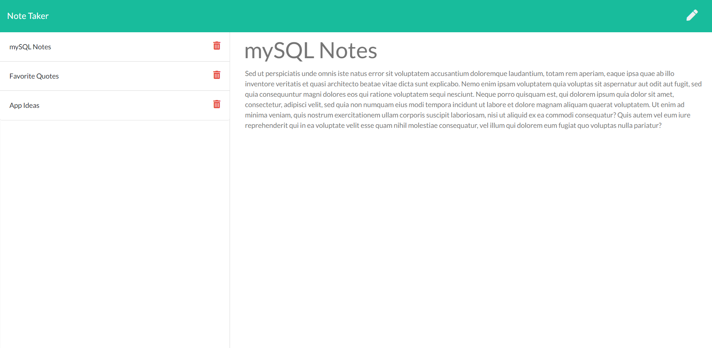

# Note-Taker
 an application that can be used to write, save, and delete notes using an express backend and save and retrieve note data from a JSON file. 

## User Story
AS A user, I want to be able to write and save notes

I WANT to be able to delete notes I've written before

SO THAT I can organize my thoughts and keep track of tasks I need to complete

## Images
Landing page

Note taking interface

## Links to Project

### GitHub
[note-taker](https://github.com/aagrosse/Note-Taker)

 ### Heroku
[note-taker]()
